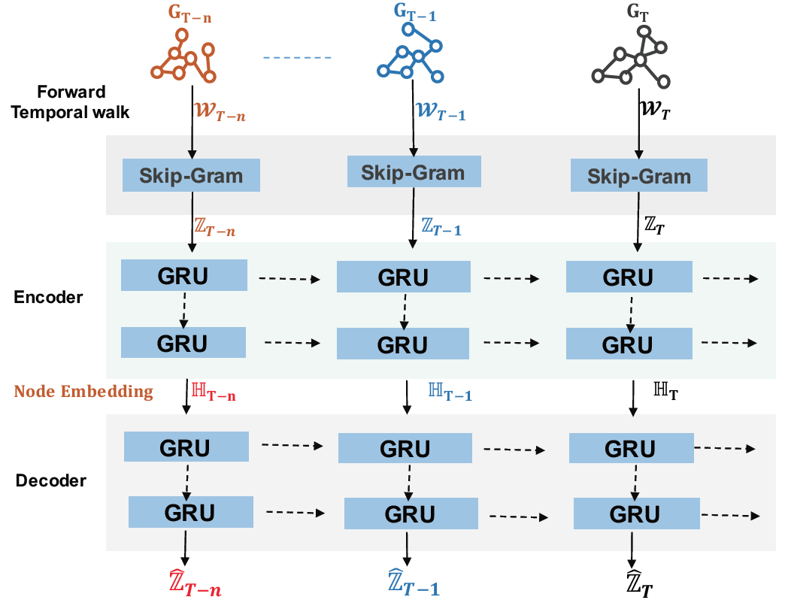

PIKACHU: Temporal Walk Based Dynamic Graph Embedding for Network Anomaly Detection
============

PIKACHU, a sophisticated, unsupervised, temporal walk-based dynamic network
embedding technique that can capture both network topology as
well as highly granular temporal information. PIKACHU learns
the appropriate and meaningful representation by preserving
the temporal order of nodes. This is important information to
detect Advanced Persistent Threat (APT) as temporal order helps
to understand the lateral movement of the attacker.

This is a TensorFlow implementation of the PIKACHU model as described in our paper:

Paudel, R., Huang, H. (2022). PIKACHU: Temporal Walk Based Dynamic Graph Embedding for Network Anomaly Detection, [https://www.researchgate.net/profile/Ramesh-Paudel-2/publication/360177229_PIKACHU_Temporal_Walk_Based_Dynamic_Graph_Embedding_for_Network_Anomaly_Detection/links/6266bf78bca601538b679392/PIKACHU-Temporal-Walk-Based-Dynamic-Graph-Embedding-for-Network-Anomaly-Detection.pdf], published in NOMS 2022.



We borrowed part of code (for short-term embedding) from Nguyen, et.al, continuous-time dynamic network embeddings (CTDNE) [https://github.com/LogicJake/CTDNE]


## Requirements
* TensorFlow (2.0 or later)
* python 3.6
* networkx
* scikit-learn
* scipy
* tqdm

## Run from
You can choose to run the model in train mode or in test mode. For test mode, we only do anomlay detection by loading the already stored the embedding generated by PIKACHU from weights/ folder.

```bash
python main.py --train False
```

If you want to train mode:

```bash
python main.py --train True
```
## Data

In order to use your own data, you have to provide edge list with timestamp, src_node, dest_node.
Have a look at the dataset/lanl or dataset/optc folder for an example.

In this example, we load DARPA OpTC network data. The original datasets can be found here: https://github.com/FiveDirections/OpTC-data. We parsed the network flow object from this dataset and extracted timestamp, source ip and destination ip

## Cite

Please cite following papers if you use this code in your own work:

```
@inproceedings{paudel2022pikachu,
  title={PIKACHU: Temporal Walk Based Dynamic Graph Embedding for Network Anomaly Detection.},
  author={Paudel, Ramesh and Huang, Howie},
  booktitle={NOMS},
  year={2022}
}
```
